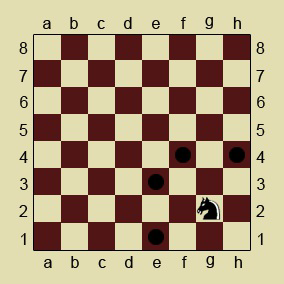

<h2>Knight Moves</h2>

<h3>Challenge Description:</h3>

    In chess, the knight moves to any of the closest squares that are not on the same rank, file, or diagonal.
    Thus the move is in the &#x201C;L&#x201D; form: two squares vertically and one square horizontally, or two squares
    horizontally and one square vertically:

    

    Your task is to find all possible positions for the next move of the knight on the empty chessboard.

<h3>Input sample:</h3>

    The first argument is a filename that contains positions of the knight on the chessboard in the <em>CN</em> form,
    where:

<ul>
<li><em>C</em> is a letter from &#x201C;a&#x201D; to &#x201C;h&#x201D; and denotes a column.</li>
<li><em>N</em> is a number from 1 to 8 and denotes a row.</li>
</ul>

Each position is indicated in a new line.

For example:

<pre class="description-input-output">g2
a1
d6
e5
b1</pre>

<h3>Output sample:</h3>

Print to stdout all possible positions for the next move of the knight ordered alphabetically.

For example:

<pre class="description-input-output">e1 e3 f4 h4
b3 c2
b5 b7 c4 c8 e4 e8 f5 f7
c4 c6 d3 d7 f3 f7 g4 g6
a3 c3 d2</pre>

<h3>Constraints:</h3>
<ul>
<li>The number of test cases is 40.</li>
</ul>
