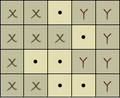
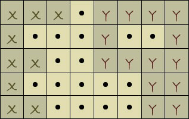

<h2>Details</h2>

<h3>Challenge Description:</h3>

    There are two details on a M*N checkered field. The detail X covers several (at least one first cell) cells in each line.
    The detail Y covers several (at least one last cell) cells. Each cell is either fully covered with a detail or not.

For example:

    

    Also, the details may have cavities (or other complex structures). Please see example below (the detail Y is one detail):

  

    The detail Y starts moving left (without any turn) until it bumps into the X detail at least with one cell.
    Determine by how many cells the detail Y will be moved.

<h3>Input sample:</h3>

    The first argument is a file with different test cases. Each test case contains a matrix the lines of which are
    separated by comma. (Empty cells are marked as &quot;.&quot;)

For example:

<pre class="description-input-output">XX.YY,XXX.Y,X..YY,XX..Y
XXX.YYYY,X...Y..Y,XX..YYYY,X.....YY,XX....YY
XX...YY,X....YY,XX..YYY,X..YYYY
XXYY,X..Y,XX.Y</pre>

<h3>Output sample:</h3>

Print out the number of cells the detail Y will be moved.

For example:

<pre class="description-input-output">1
1
2
0</pre>

<h3>Constraints:</h3>

<ol>
<li>The matrices can be of different M*N sizes. (2 &lt;= M &lt;= 10, 2 &lt;= N &lt;= 10)</li>
<li>Number of test cases is 40.</li>
</ol>
