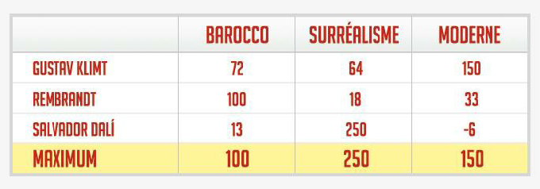

<h2>Find the highest score</h2>

<h3>Challenge Description:</h3>

    You decided to hold a banquet in honor of the World Art Day, where you invited all designers and artists that
    you know. During the banquet, you decided to find out which art movement and style the ordinary people like
    most of all, and whose works can get the highest score. To find the answer, you decided to hold an exhibition,
    where viewers will be able to evaluate each painting and vote for or against it. Each artist should create one
    work per each art movement.  
    After the exhibition, the participants calculated votes that they received for each painting and inserted them
    in the table. But, they could not determine which movement has won and whose work received the highest score,
    so they asked you to help.  
    You need to determine and print the highest score of each category in the table.

    

<h3>Input sample:</h3>

    The first argument is a path to a file. Each line includes a test case with a table. Table rows are separated
    by pipes &apos;|&apos;. All table rows contain scores for each category, so all lines are of an equal length.

    For example:

<pre class="description-input-output">72 64 150 | 100 18 33 | 13 250 -6
10 25 -30 44 | 5 16 70 8 | 13 1 31 12
100 6 300 20 10 | 5 200 6 9 500 | 1 10 3 400 143</pre>

<h3>Output sample:</h3>

    You need to print the highest score for each category.

    For example:

<pre class="description-input-output">100 250 150
13 25 70 44
100 200 300 400 500</pre>

<h3>Constraints:</h3>
<ol>
<li>All lines in a test case are of an equal length.</li>
<li>The number of participants can be from 2 to 10 people.</li>
<li>The number of categories can be from 4 to 20.</li>
<li>The number of points for one picture can be from -1000 to 1000.</li>
<li>The number of test cases is 40.</li>
</ol>
