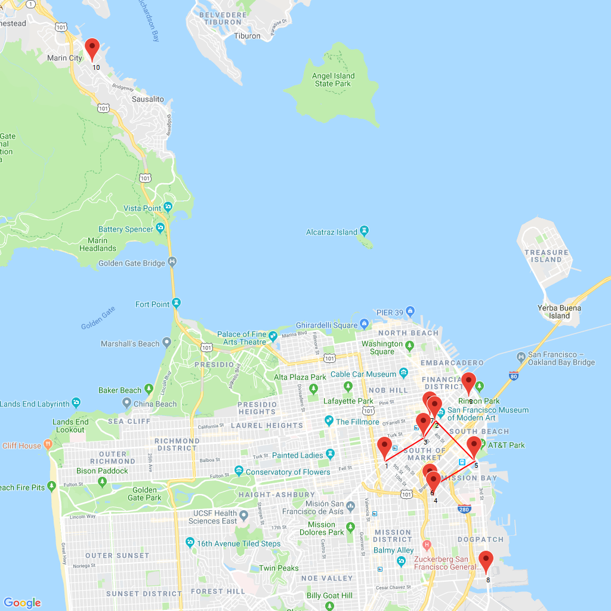

<h2>Commuting Engineer</h2>

<h3>Challenge Description:</h3>

    

    Commuters in the bay area who commute to and from South Bay spend
    on average 2-3 hours of valuable time getting to and from work every day.
    That&apos;s why startups like Mashery, Flurry, New Relic and Glassdoor
    have called the San Francisco Peninsula their home.

    Today, we&apos;re visiting some of area&apos;s fastest growing startups
    and would like to find the shortest possible distance to visit
    each company once starting from the CodeEval offices at 1355 Market Street.

    Solving the following challenge means finding the shortest possible route which visits each coordinate once starting from the point 1.
    You may read more about the <a href="http://en.wikipedia.org/wiki/Travelling_salesman_problem">Travelling salesman problem</a>

    On the map you can see the best route for 6 coordinates.
    But we&apos;ve added 4 more for the offices of Mashery, Flurry, New Relic
    and Glassdoor. So you need to find the best route for 10 coordinates.

<h3>Input sample:</h3>

    Your program should accept as its first argument a path to a filename. Input example is the following

<pre class="description-input-output">1 | CodeEval 1355 Market St, SF (37.7768016, -122.4169151)
2 | Yelp 706 Mission St, SF (37.7860105, -122.4025377)
3 | Square 110 5th St, SF (37.7821494, -122.4058960)
4 | Airbnb 99 Rhode Island St, SF (37.7689269, -122.4029053)
5 | Dropbox 185 Berry St, SF (37.7768800, -122.3911496)
6 | Zynga 699 8th St, SF (37.7706628, -122.4040139)</pre>

    The following locations will also be present in the input file:
 
<b>
        7 | Mashery 717 Market St, SF (37.7870361, -122.4039444)
 
        8 | Flurry 3060 3rd St, SF (37.7507903, -122.3877184)
 
        9 | New Relic 188 Spear St, SF (37.7914417, -122.3927229)
 
        10 | Glassdoor 1 Harbor Drive, Sausalito (37.8672841, -122.5010216)
</b>

<h3>Output sample:</h3>

    It must start from position 1

<pre class="description-input-output">1
3
2
5
6
4</pre>

    (Check points on the map)

