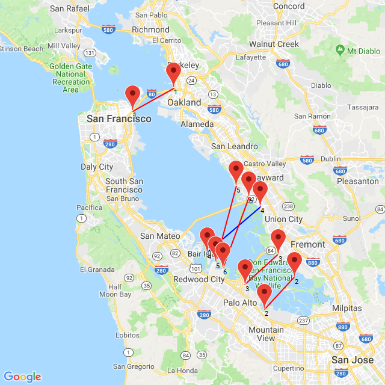

<h2>Bay Bridges</h2>

<h3>Challenge Description:</h3>

    

    A new technological breakthrough has enabled us to build bridges that can
    withstand a 9.5 magnitude earthquake for a fraction of the cost. Instead of
    retrofitting existing bridges which would take decades and cost at least
    3x the price we&apos;re drafting up a proposal rebuild all of the bay area&apos;s
    bridges more efficiently between strategic coordinates outlined below.

    You want to build the bridges as efficiently as possible and connect as many
    pairs of points as possible with bridges such that no two bridges cross.
    When connecting points, you can only connect point 1 with another point 1,
    point 2 with another point 2.

    At example given on the map we should connect all the points except points
    with number 4.

<h3>Input sample:</h3>

    Your program should accept as its first argument a path to a filename.
    Input example is the following

<pre class="description-input-output">1: ([37.788353, -122.387695], [37.829853, -122.294312])
2: ([37.429615, -122.087631], [37.487391, -122.018967])
3: ([37.474858, -122.131577], [37.529332, -122.056046])
4: ([37.532599,-122.218094], [37.615863,-122.097244])
5: ([37.516262,-122.198181], [37.653383,-122.151489])
6: ([37.504824,-122.181702], [37.633266,-122.121964])</pre>

    Each input line represents a pair of coordinates for each possible bridge.

<h3>Output sample:</h3>

    You should output bridges in ascending order.

<pre class="description-input-output">1
2
3
5
6</pre>

    (Check lines on the map)

