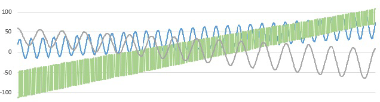

<h2>The Frequency</h2>

<h3>Challenge Description:</h3>

    You are given 0.1 second short segments of signals of different shapes, represented as sequences of integer numbers
    from -127 to 127. Sampling rate is 20,000 Hz (e.g., samples are taken with 1/20,000 sec time interval). The signal
    may contain some slight noise. On the segment, the signal amplitude can increase or decrease linearly, as well as
    the signal can move linearly up or down relative to zero level:

    

    Your task is to find the frequency of each signal.

<h3>Input sample:</h3>

    The first argument is a file with signals data, one signal per line. Signal samples are space delimited.

    For example:

<pre class="description-input-output">20 22 23 25 27 27 30 30 30 31 ... ... 53 55 56 61 62 64 67 68 72 74
-113 -111 -111 -111 -111 -111 -111 -47 -47 -47 ... ... 71 71 71 107 107 107 107 107 107 107
59 58 58 58 58 58 57 57 57 56 ... ... 4 5 6 7 7 8 8 8 8 8</pre>
 

    (Some samples were skipped, you can <a href="/static/challenges/frequency.txt">download full example</a>)

<h3>Output sample:</h3>

    Print to stdout the signal frequencies in Hz, one per line.

    For example:

<pre class="description-input-output">310
1360
160</pre>

<h3>Constraints:</h3>
<ol>
<li>Signal waveform can be sine, triangle, sawtooth, or square.</li>
<li>Signal frequency is a multiple of 10 and is in the range from 150 Hz to 2000 Hz.</li>
<li>Noise amplitude does not exceed 10 percent of the signal amplitude.</li>
<li>Signal amplitude is not lower than 20.</li>
<li>Signal amplitude change and the move relative to zero level on the segment are linear and do not change
        their direction.</li>
</ol>
