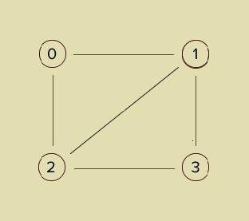

<h2>Distinct Triangles</h2>

<h3>Challenge Description:</h3>

    Alice the archaeologist has just entered the tomb of the Pharaoh. She turns on her flashlight and notices an
    undirected graph painted on the wall, with V nodes and E edges. Suddenly, the stone door behind her slams shut.
    Fortunately, Alice knows the way out - she must place N pebbles upon the altar to re-open the door, where N is
    the number of triangles in the graph.

For example:

    

    N is 2 in this graph.

<h3>Input sample:</h3>

    The first argument is a file with different test cases. Each test case begins with two integers, V and E (1 &lt;= V, E &lt;= 100),
    separated by a space and finishes with following symbol &quot;;&quot;. Then, E edges, which represented as two integers separated
    by space, Each edge is comma separated. Each vertex is in the range (0 &lt;= vertex &lt; V).

For example:

<pre class="description-input-output">4 5;0 2,0 1,1 2,1 3,2 3
9 3;1 3,1 8,3 8
9 3;5 6,5 7,6 7</pre>

<h3>Output sample:</h3>

Print out the number of distinct triangles formed over three vertices and edges in the graph.

For example:

<pre class="description-input-output">2
1
1</pre>

<h3>Constraints:</h3>

<ol>
<li>1 &lt;= V, E &lt;= 100</li>
<li>0 &lt;= vertex &lt; V</li>
<li>Number of test cases is 10.</li>
</ol>
