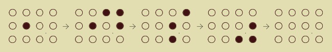

<h2>Lights Out</h2>

<h3>Challenge Description:</h3>

    Bob operates all electronic lights at the circus. Lately, there is a defective circuit board that is causing him
    some problems. The circuit board controls a rectangular box filled with N by M lights, which each may be on or off
    depending on the lighting needs of the performers.

    However, each time he presses the button to toggle a particular
    light on or off, the circuit board toggles not only that light, but also the lights above, below, to the left,
    and to the right of the light.

    O = light is on
    . = light is off

    Example:

    

    toggle lights as follows: row 1, column 4; row 2, column 3; row 2, column 4; and row 3, column 4

Bob needs to turn off all the lights. Write a program that prints the
minimum number of times he must press a button on the board so that
all the lights turn off, or -1 if it is not possible.

<h3>Input sample:</h3>

    The input begins with two integers on a line, N and M (1 &lt;= N,M &lt;= 10), separated by a space. Then, N light box row
    follow, separated by pipe. Each row has M characters either &apos;.&apos; or &apos;O&apos;, indicating a light that is current off
    or a light that is currently on, respectively.

<pre class="description-input-output">4 10 ...OOOOOOO|.OO.O.O...|.OO..OO.OO|...O....O.
3 3 ..O|OOO|OOO
5 7 .O.O...|..O.O..|.O.O..O|.O..OOO|OO.OOOO</pre>

<h3>Output sample:</h3>

    For each test case print a line containing the minimum number of clicks that will turn off all the lights,
    or -1 if it is not possible to turn off all the lights.

<pre class="description-input-output">19
2
-1</pre>

<h3>Constraints:</h3>
<ol>
<li>Number of test cases is equal to 20.</li>
</ol>
