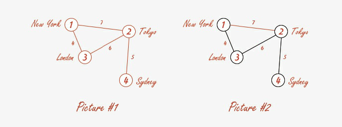

<h2>The Tourist</h2>

<h3>Challenge Description:</h3>

    Every two years, a thief known as Tourist travels to several cities one by one, steals the most precious gemstones,
    and then disappears for two years. Recently, our thief has begun a new operation.  
    Our detective is sure that he can catch him at the exhibition in
    Paris, but the problem is that he does not know how the Tourist looks like. That is why he first wants to collect
    possible evidence and interview witnesses in the cities where the thief has operated before: New York, Tokyo,
    London, and Sydney (see Picture # 1). He must visit these cities and make it back to Paris in time.
    Help him find the shortest route between these cities and calculate its length.  
    The shortest route is New York &gt; London &gt; Tokyo &gt; Sydney, which is 15,000 miles long; it is shown on Picture #2.
 

    

<h3>Input sample:</h3>

    The first argument is a path to a file. Each line includes a test case, which contains three numbers:  
    - The first two numbers is a route from one city to another.  
    - The third number is the route length.  
    Routes are separated by pipelines &apos;|&apos;.

    For example:

<pre class="description-input-output">1 2 1 | 2 3 2 | 3 1 3
1 2 2 | 2 3 2 | 3 4 2 | 4 1 2 | 2 4 3</pre>

<h3>Output sample:</h3>

    You need to calculate the shortest route between the cities. It is possible that there is no route
    (maybe our informers got something wrong); in this case &#x2013; print False.

    For example:

<pre class="description-input-output">3
6</pre>

<h3>Constraints:</h3>
<ol>
<li>You must visit all cities.</li>
<li>Number of cities in a test case is from 3 to 100.</li>
<li>If there is no possible route, print False.</li>
<li>The number of test cases is 20.</li>
</ol>
