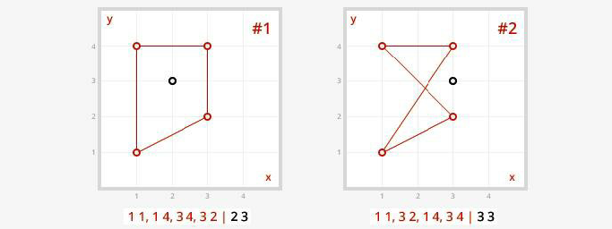

<h2>Prisoner or Citizen</h2>

<h3>Challenge Description:</h3>

    No matter where you are, there are always good and bad people everywhere, those who have never broken the law, and
    those who are constantly abusing it.  
    The goal of our challenge is not to persuade you to obey the laws, become better, or vice versa. Everyone has a
    right to make his own life choice.  
    Your task is to find out where a person is&#x2014;in jail or at large&#x2014;depending on the coordinates.
 

    

<h3>Input sample:</h3>

    The first argument is a path to a file. Each line includes a test case with the coordinates of jail and a person,
    separated by a pipeline &apos;|&apos;. All coordinates are in the (x, y) format. Coordinates of a jail, which form a jail
    square, are separated by comma &apos;,&apos;.
 
    Coordinates of a prison should be united in the provided sequence (as shown on the picture).

<pre class="description-input-output">1 1, 1 4, 3 4, 3 2 | 2 3
1 1, 3 2, 1 4, 3 4 | 3 3
1 1, 1 3, 3 3, 3 1 | 1 2</pre>

<h3>Output sample:</h3>

    Find out where a person is&#x2014;in jail or at large&#x2014;depending on the coordinates. If in jail, print Prisoner;
    otherwise, print Citizen.

<pre class="description-input-output">Prisoner
Citizen
Prisoner</pre>

<h3>Constraints:</h3>
<ol>
<li>All coordinates are from 0 to 10 and cannot be negative.</li>
<li>Coordinates of a prison should be united in the provided sequence (as shown on the picture).</li>
<li>The number of coordinates of a prison can be from 3 to 12.</li>
<li>If coordinates of a person fall into the prison line, print Prisoner (see input sample # 3).</li>
<li>The number of test cases is 20.</li>
</ol>
