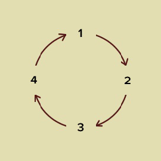

<h2>Consecutive Primes</h2>

<h3>Challenge Description:</h3>

    Alice has an even number of N beads, and each bead has a number from 1 to N painted on it. She would like to make
    a necklace out of all the beads, with a special requirement: any two beads next to each other on the necklace must
    sum to a prime number. Alice needs your help to calculate how many ways it is possible to do so.

For example:

    N = 4

    There are two possible ways to build the necklace. Note that the last bead connects to the first bead.

<pre>1 2 3 4
1 4 3 2
</pre>

<b>Note:</b> The necklace should be unique. 
    For example: <i>1 2 3 4</i> is the same as <i>2 3 4 1</i> and <i>3 4 1 2</i> and <i>4 1 2 3</i>.

    

    So the answer is 2.

<h3>Input sample:</h3>

    The inputs consists of one even integer on a line. Each integer N is 2 &lt;= N &lt;= 18.

For example:

<pre class="description-input-output">2
4
5</pre>

<h3>Output sample:</h3>

Print a line containing the number of ways to make a necklace according to the above rules. If not even number print 0.

For example:

<pre class="description-input-output">1
2
0</pre>

<h3>Constraints:</h3>

<ol>
<li>2 &lt;= N &lt;= 18</li>
<li>Number of test cases is 5.</li>
</ol>
