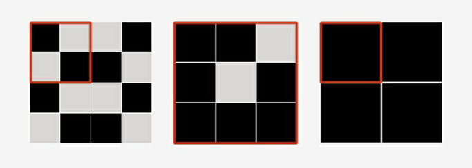

<h2>Black or white</h2>

<h3>Challenge Description:</h3>

    Your friend has a very large car park because he buys a new car each month but only of a black or white color.
    And there are so many of them that he asked his assistant to arrange these cars in a form of a square matrix.
    But the cars must be placed in such a way that you could find/calculate the area (submatrix), count the number of
    black cars on it, move to another part of the car park, measure the same area, and get the same number of
    black cars on it.
 
    Now your friend wants to check whether assistant managed to do it and he assigned you to check it. 
    You need to find the smallest submatrix where there will always be the same amount of black cars in any
    place of the car park. 
    You can see on photo three different car parks (square matrix) and red submatrix on them. If you move this submatrix in any area on
    the main matrix you always get the same number of black cars.

    

<h3>Input sample:</h3>

    The first argument is a path to a file. Each line includes a test case where there is a square matrix (car park).
    Each new line of the matrix is separated by a vertical bar &apos;|&apos;. The matrix consists of 0 (white cars)
    and 1 (black cars).

    For example:

<pre class="description-input-output">11 | 11
1001 | 0110 | 1001 | 0110
110 | 101 | 111
000 | 000 | 000</pre>

<h3>Output sample:</h3>

    You should get the size of the smallest submatrix which you can move over the matrix any way you like so that the
    amount of black cars is always the same. Also, you should get the amount of black cars in this submatrix
    (comma separated).

    For example:

<pre class="description-input-output">1x1, 1
2x2, 2
3x3, 7
1x1, 0</pre>

<h3>Constraints:</h3>
<ol>
<li>The matrix consists only of 0 (white cars) and 1 (black cars).</li>
<li>The length of a square matrix can be from 2 to 25 cars.</li>
<li>The number of test cases is 40.</li>
</ol>
