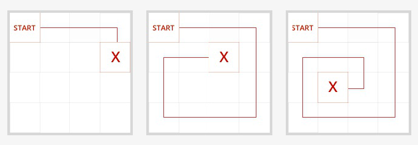

<h2>Robo and Robitta</h2>

<h3>Challenge Description:</h3>

    A robot named Robo loves to collect nuts and share them with his girlfriend Robitta. She uses nuts to make beautiful
    jewelry. Today, our robots have a date. As usual, Robo will bring nuts, which he gathers on his way to Robitta.
    Help Robitta learn how many nuts Robo will bring this time to decide what jewelry she will be able to make.

    Robo always starts his path from the upper-left cell and goes only straight. There is a nut in each cell. When Robo
    enters a cell, he picks up a nut, and then goes to the next cell. When he gets to an empty cell or reaches the last
    cells, he turns 90 degrees right. This way Robo continues until he meets Robitta.  
    For example, in the first case, Robo will bring 5 nuts, in the second case &#x2013; 14 nuts, and in the third case &#x2013; 16 nuts.
 

    

<h3>Input sample:</h3>

    The first argument is a path to a file.  Each line includes a test case, which contains the size of the field that
    Robo will go through, and X and Y coordinates of a place where Robitta waits for him. Field size and coordinates
    are separated by a vertical bar &apos;|&apos;.

    For example:

<pre class="description-input-output">3x2 | 2 1
4x4 | 3 3</pre>

<h3>Output sample:</h3>

    You should print the number of nuts that Robo will bring to Robitta.

    For example:

<pre class="description-input-output">5
14</pre>

<h3>Constraints:</h3>
<ol>
<li>Field size can be from 2 to 50 cells height and width.</li>
<li>The field may be square or rectangle. </li>
<li>There is only one nut in a cell.</li>
<li>The number of test cases is 40.</li>
</ol>
