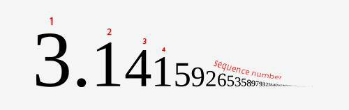

<h2>To PI or not to PI</h2>

<h3>Challenge Description:</h3>

    As we know from our school history course, the ancient civilizations needed &#x3C0; (PI) value for the mathematical
    calculations. In the 5th century, the Chinese mathematicians calculated this value to seven decimal digits by using
    geometrical technics. In Indian mathematics, it was calculated to five decimal digits. As the computer science
    developed, the mathematicians managed to calculate the decimal representation of PI to over 10 trillion digits.
 
    Surely, we do not need the PI value calculated to 10 trillion digits, but 5000 digits sound just right. So, we
    need to define the number located at the certain sequence number in PI. 

    

<h3>Input sample:</h3>

    The first argument is a path to a file. Each line includes a test case, which comprises a number indicating the
    sequence number of a PI value.

<pre class="description-input-output">3
1
1654</pre>

<h3>Output sample:</h3>

    Print the number that is located at that sequence number.

<pre class="description-input-output">4
3
1</pre>

<h3>Constraints:</h3>
<ol>
<li>The sequence number cannot exceed 5000.</li>
<li>Comma in the PI value is not a sequence number element.</li>
<li>The number of test cases is 30.</li>
</ol>
